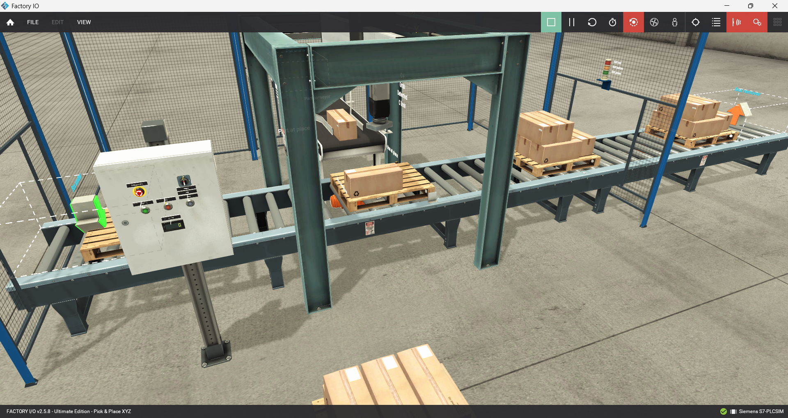
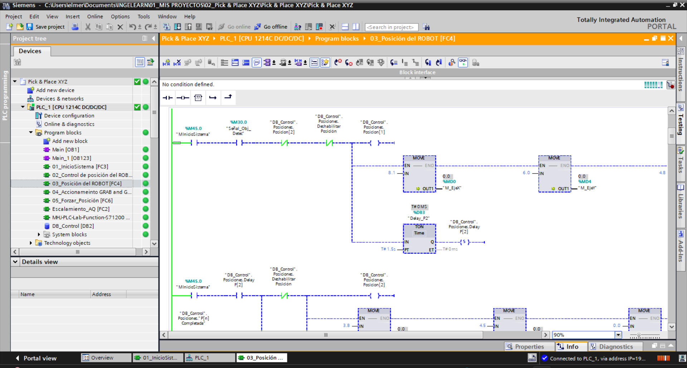

## 🤖 Pick & Place XYZ – Automatización Industrial

Sistema automatizado Pick & Place XYZ desarrollado con PLC Siemens S7-1200, TIA Portal y Factory I/O para el transporte y posicionamiento automático de cajas mediante un robot cartesiano industrial.

## Descripción del Proyecto

Este proyecto implementa un sistema de automatización industrial tipo Pick & Place XYZ, capaz de detectar, transportar y posicionar cajas automáticamente sobre pallets utilizando control secuencial y lógica Ladder.

La simulación fue desarrollada en Factory I/O y la lógica de control implementada en TIA Portal utilizando un PLC Siemens S7-1200.

El sistema simula una línea industrial automatizada donde se realiza:

✅Detección de materiales mediante sensores
✅Conteo de cajas
✅Transporte mediante conveyor
✅Posicionamiento automático XYZ
✅Secuencias automáticas de movimiento

## 🖼️ Capturas del proyecto

## Simulación en Factory I/O

## Programación en TIA Portal

## 🎥 Video demostrativo
https://www.youtube.com/watch?v=HeecjVIeOUk

## 👨‍💻 Autor

Elmer Raul Cule Huamani
